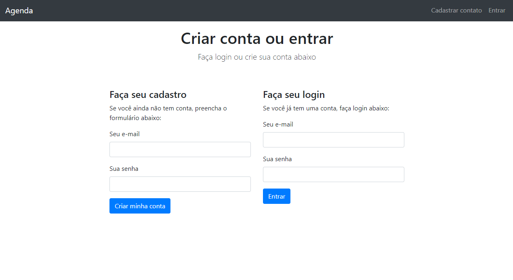
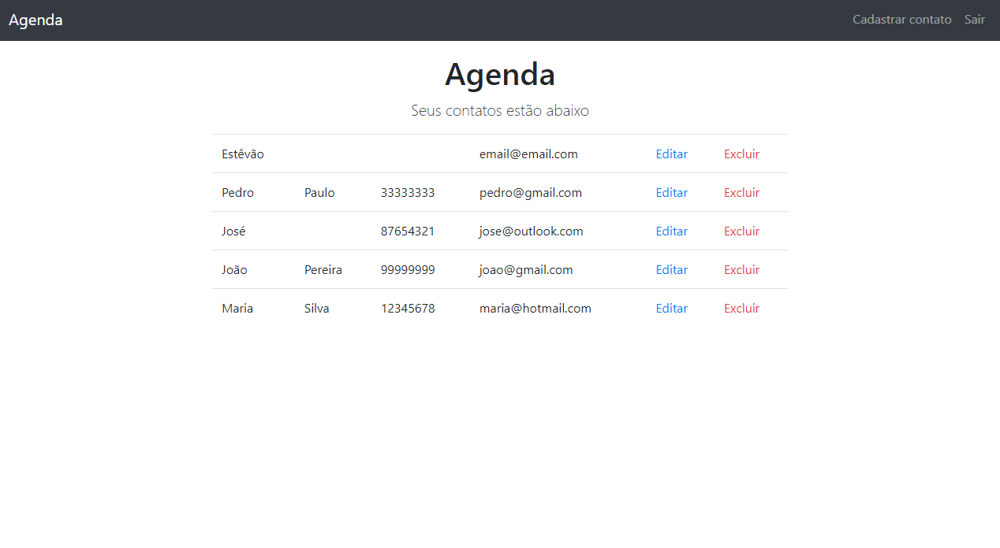
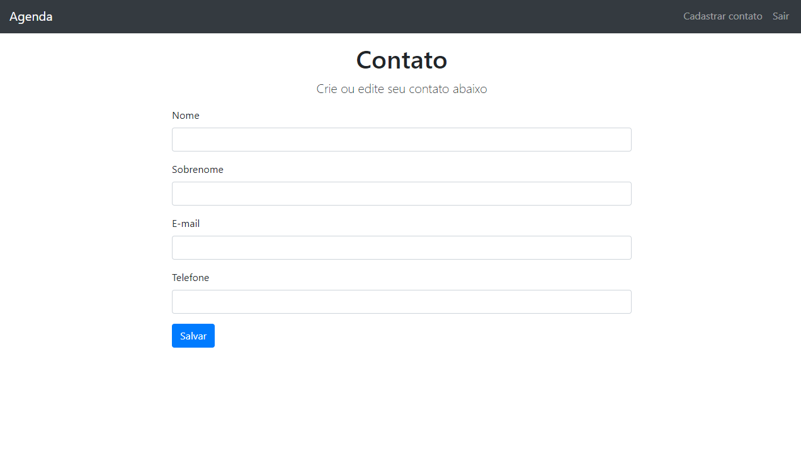

# Projeto Agenda
Uma simples agenda com login, adicionar, editar e excluir contatos.

👉 <a 
href="https://youtu.be/aG6yPrYZAs4"
style="font-size: 1.5rem">
    Vídeo do projeto
</a>

## Índice
- [Sobre o projeto](#sobre-o-projeto);
- [Funcionalidades do projeto](#funcionalidades-do-projeto);
- [Layout](#layout);
- [Como executar o projeto](#como-executar-o-projeto);
- [Tecnologias utilizadas](#tecnologias-utilizadas);
- [Autor](#autor)

## Sobre o projeto
Um projeto simples de uma agenda em que pude praticar o desenvolvimento com Node, Express e a conexão com o banco de dados MongoDB. Além também de conceitos fundamentais de CRUD, CMV e Orientação à Objetos.

## Funcionalidades do projeto
- [x] Sign in e Log in;
- [x] Criação, edição e remoção de contatos conectado com a base de dados;
- [x] Validações básicas de Log in e e-mail.

## Layout




## Como executar o projeto

### Pré requisitos
- Conta MongoDB

### MongoDB
- Crie um projeto;
- Crie um Deployment e um usuário ("Create a database user");
- Escolha o método "Drivers" para a conexão ("Choose a connection method" > "Drivers");
- Copie o link;
- Adicione o endereço IP em Network Access (“Allow access anywhere” para adicionar o IP 0.0.0.0/0)

### Bash
```bash
# clone o repositório
git clone https://github.com/estevaof7/agenda.git

# entre na pasta
cd agenda

# crie o arquivo .env e coloque o link do MongoDB no lugar especificado
echo "CONNECTIONSTRING=<link aqui>" > .env

# instale as dependências
npm i

# Execute a aplicação
npm start

# A aplicação será iniciada na porta 3000, acesse pelo navegador: http://localhost:3000
```

## Tecnologias utilizadas
- JavaScript
- CSS / Bootstrap
- HTML / EJS
- Node.js
- Express
- Webpack
- MongoDB

## Autor
Estêvão Ferreira Caixeta

[www.linkedin.com/in/estevaof7](www.linkedin.com/in/estevaof7)